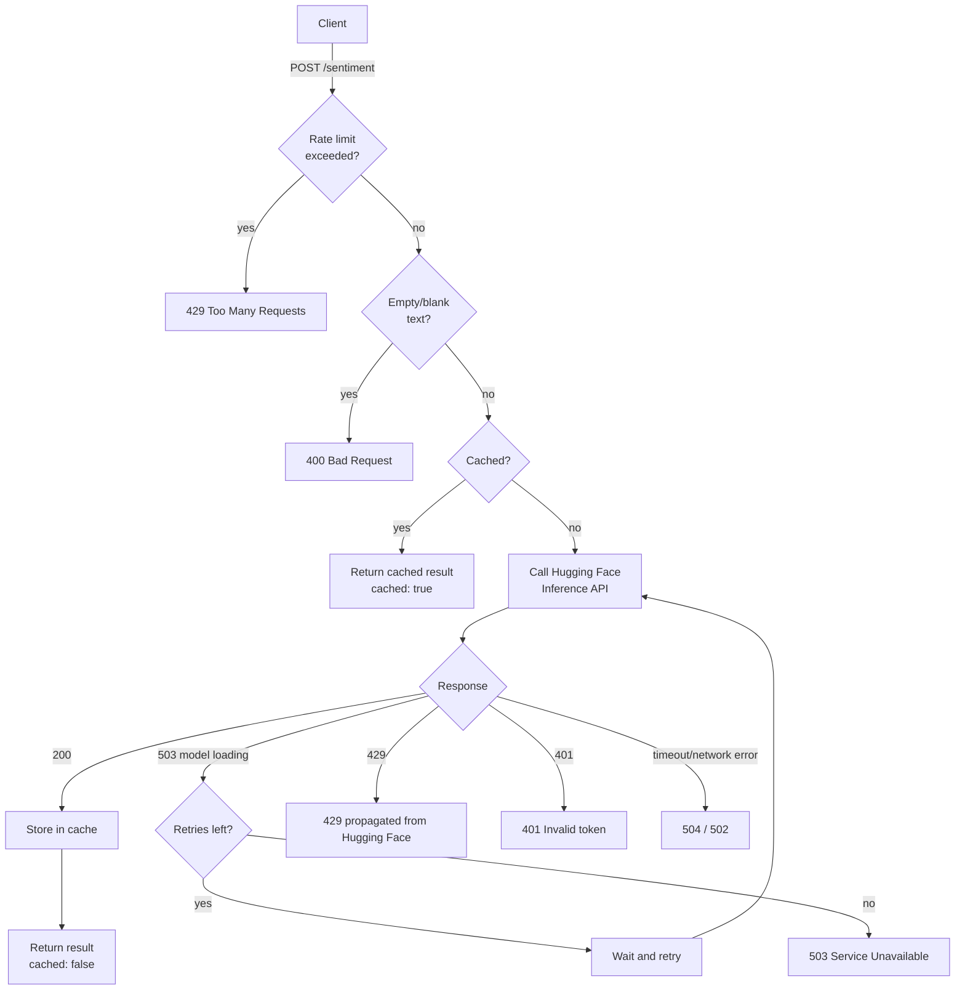

# Reto 02 — Sentiment Analysis API (Python + AI)

A FastAPI service that connects to a real AI model (Hugging Face Inference API) to classify the
sentiment of a piece of text as **POSITIVE** or **NEGATIVE**, with response caching and rate limiting.

Built for EPAM's "Python Run — Debug the Future" challenge 2 ("Dato que Piensa").

## Data source

- **Dataset**: [IMDB Dataset of 50K Movie Reviews](https://www.kaggle.com/datasets/lakshmi25npathi/imdb-dataset-of-50k-movie-reviews) (Kaggle, by lakshmi25npathi).
- The full dataset is **not** committed to this repository (it is large and the review text is
  user-generated/copyrighted content). Instead, [`data/sample_reviews.csv`](data/sample_reviews.csv)
  contains 20 short, original example reviews (written for this project) with the same
  `text,label` schema, used by [`scripts/evaluate.py`](scripts/evaluate.py) to demonstrate accuracy
  end-to-end against the live API.
- To reproduce results on the real dataset: download the CSV from Kaggle, keep only the `review`
  and `sentiment` columns, rename them to `text` and `label` (values `POSITIVE`/`NEGATIVE`), and
  point `scripts/evaluate.py` at that file with `--csv`.

## AI model / service

- **Service**: [Hugging Face Inference API](https://huggingface.co/docs/api-inference/index)
- **Model**: [`distilbert/distilbert-base-uncased-finetuned-sst-2-english`](https://huggingface.co/distilbert/distilbert-base-uncased-finetuned-sst-2-english)
  — a DistilBERT model fine-tuned on SST-2, returning `POSITIVE`/`NEGATIVE` labels with a confidence score.
- Requests go through the current Hugging Face routing endpoint,
  `https://router.huggingface.co/hf-inference/models/{model}` (the older
  `api-inference.huggingface.co` host has been retired).
- The model name is configurable via the `HF_MODEL` environment variable if you want to swap models
  (use the fully namespaced id, e.g. `owner/model-name`).

## Project structure

```
app/
  main.py              FastAPI app and /sentiment, /health endpoints
  sentiment_client.py  Hugging Face API client (retries, error handling)
  cache.py             In-memory TTL cache for repeated requests
  config.py            Environment-variable based configuration
data/
  sample_reviews.csv   Small labeled sample for the evaluation script
docs/
  adr/                 Architecture Decision Records (why things were built this way)
scripts/
  evaluate.py          Calls the running API against a labeled CSV and reports accuracy
tests/
  test_main.py         Unit tests (Hugging Face calls are mocked, no network/API key needed)
Dockerfile
requirements.txt
.env.example
```

## Architecture decisions

Key design decisions (which AI service and model to use, why sentiment
analysis over summarization/NER, why a sample dataset instead of the full
CSV, caching and rate-limiting design, etc.) are documented as ADRs in
[`docs/adr/`](docs/adr/README.md).

## Request flow



## Setup

1. **Clone the repo and create a virtual environment**

   Using [`uv`](https://docs.astral.sh/uv/) (recommended, much faster):

   ```bash
   uv venv .venv
   uv pip install -r requirements.txt --python .venv
   ```

   Or with plain `pip`:

   ```bash
   python -m venv venv
   source venv/bin/activate  # on Windows: venv\Scripts\activate
   pip install -r requirements.txt
   ```

2. **Set your Hugging Face API token**

   Get a free token at https://huggingface.co/settings/tokens (read access is enough), then:

   ```bash
   cp .env.example .env
   # edit .env and set HF_API_TOKEN=hf_xxxxxxxxxxxxxxxx
   ```

   The API key is **never** hardcoded — it is read from the environment via `python-dotenv`.

## Running the API

Activate the virtual environment first (`source .venv/bin/activate` or, on Windows,
`.venv\Scripts\activate`), then:

```bash
uvicorn app.main:app --host 0.0.0.0 --port 8000
```

The API will be available at `http://localhost:8000`. Interactive docs (Swagger UI) are at
`http://localhost:8000/docs`.

### Endpoints

**`GET /health`** — liveness check.

```bash
curl http://localhost:8000/health
```

**`POST /sentiment`** — classify the sentiment of a text.

```bash
curl -X POST http://localhost:8000/sentiment \
  -H "Content-Type: application/json" \
  -d '{"text": "I absolutely loved this movie, best one this year!"}'
```

Response:

```json
{
  "text": "I absolutely loved this movie, best one this year!",
  "label": "POSITIVE",
  "score": 0.9998,
  "cached": false
}
```

### Error handling

| Situation                                   | HTTP status | Notes                                            |
|----------------------------------------------|:-----------:|---------------------------------------------------|
| Empty or whitespace-only `text`               | 400         | Rejected before calling the model                  |
| Missing `text` field                          | 422         | FastAPI/Pydantic request validation                |
| Missing/invalid `HF_API_TOKEN`                | 500 / 401   | Checked before calling Hugging Face                |
| Hugging Face model still loading              | 503         | Retried automatically (`wait_for_model`, up to `MAX_RETRIES`) before giving up |
| Hugging Face rate limit hit                   | 429         | Propagated to the caller                           |
| Hugging Face unreachable / timeout            | 502 / 504   | Network-level failures                             |
| Too many requests to **this** API             | 429         | Enforced by this service's own rate limiter (see below) |

## Running the evaluation script

With the API running in one terminal, in another terminal:

```bash
python scripts/evaluate.py --csv data/sample_reviews.csv --url http://localhost:8000/sentiment
```

This calls the live endpoint for every row in the CSV and prints an accuracy score, e.g.:

```
Evaluated 20 samples (0 request errors).
Accuracy: 19/20 = 95.0%
```

## Running tests

Unit tests mock the Hugging Face call, so no API key or network access is required:

```bash
pytest
```

## Bonus A — Docker

Build and run the API in a container:

```bash
docker build -t sentiment-api .
docker run --rm -p 8000:8000 -e HF_API_TOKEN=hf_xxxxxxxxxxxxxxxx sentiment-api
```

## Bonus B — Caching and rate limiting

- **Caching**: identical requests (same normalized text) are served from an in-memory TTL cache
  (`app/cache.py`, via `cachetools`) instead of calling Hugging Face again. Default TTL is 1 hour
  and max size is 1000 entries, both configurable via `CACHE_TTL_SECONDS` / `CACHE_MAX_SIZE`. The
  response includes a `"cached": true/false` field so callers can see when a cached result was used.
- **Rate limiting**: incoming requests to `/sentiment` are rate-limited per client IP using
  `slowapi` (default `10/minute`, configurable via the `RATE_LIMIT` env var). Requests over the
  limit receive an HTTP 429. This protects both this service and the underlying Hugging Face quota.

## Configuration reference

All configuration is read from environment variables (see [`.env.example`](.env.example)):

| Variable                  | Default                                              | Description                          |
|----------------------------|-------------------------------------------------------|---------------------------------------|
| `HF_API_TOKEN`             | *(required)*                                          | Hugging Face API token                |
| `HF_MODEL`                 | `distilbert/distilbert-base-uncased-finetuned-sst-2-english` | Model used for classification |
| `REQUEST_TIMEOUT_SECONDS`  | `15`                                                   | Timeout per Hugging Face request      |
| `MAX_RETRIES`              | `3`                                                     | Retries while the model is loading    |
| `CACHE_TTL_SECONDS`        | `3600`                                                 | Cache entry lifetime                  |
| `CACHE_MAX_SIZE`           | `1000`                                                  | Max cached entries                    |
| `RATE_LIMIT`               | `10/minute`                                             | Requests allowed per client IP        |

## License

This project is licensed under the [MIT License](LICENSE).
