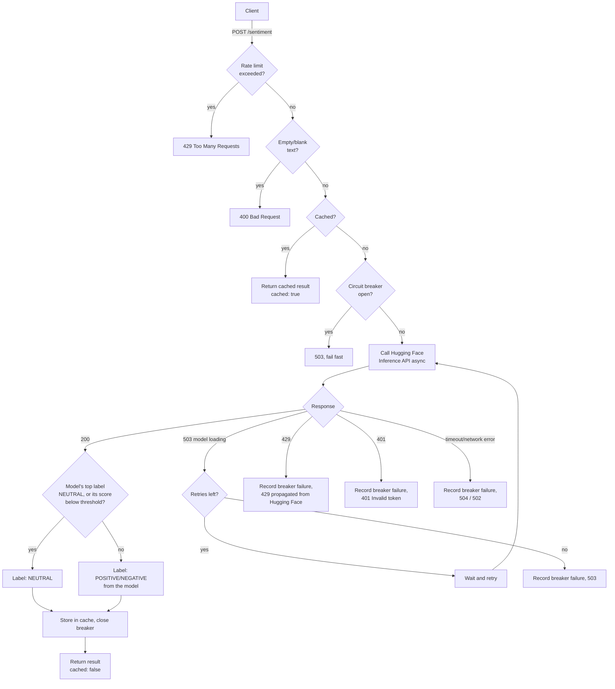

# Reto 02: Sentiment Analysis API (Python + AI)

[](https://github.com/ricardomb-tech/reto-02/actions/workflows/ci.yml)

A FastAPI service that connects to a real AI model (Hugging Face Inference API) to classify the
sentiment of a piece of text as **POSITIVE**, **NEGATIVE**, or **NEUTRAL**, with async I/O, a
batch endpoint, response caching, rate limiting, a circuit breaker, and Prometheus metrics.

Built for EPAM's "Python Run - Debug the Future" challenge 2 ("Dato que Piensa").

## Data source

- **Dataset**: [IMDB Dataset of 50K Movie Reviews](https://www.kaggle.com/datasets/lakshmi25npathi/imdb-dataset-of-50k-movie-reviews) (Kaggle, by lakshmi25npathi).
- The full dataset is **not** committed to this repository (it is large and the review text is
  user-generated/copyrighted content). Instead, [`data/sample_reviews.csv`](data/sample_reviews.csv)
  contains 30 short, original example reviews (written for this project) with the same
  `text,label` schema — 10 POSITIVE, 10 NEGATIVE, and 10 genuinely NEUTRAL (mixed-opinion or purely
  descriptive text), used by [`scripts/evaluate.py`](scripts/evaluate.py) to measure accuracy and
  per-class precision/recall/F1 end-to-end against the live API, and by
  [`scripts/calibrate_threshold.py`](scripts/calibrate_threshold.py) to calibrate
  `NEUTRAL_CONFIDENCE_THRESHOLD` (see [ADR-0015](docs/adr/0015-data-driven-neutral-threshold.md)).
- To reproduce results on the real dataset: download the CSV from Kaggle, keep only the `review`
  and `sentiment` columns, rename them to `text` and `label` (values `POSITIVE`/`NEGATIVE`), and
  point `scripts/evaluate.py` at that file with `--csv`.

## AI model / service

- **Service**: [Hugging Face Inference API](https://huggingface.co/docs/api-inference/index)
- **Model**: [`cardiffnlp/twitter-roberta-base-sentiment-latest`](https://huggingface.co/cardiffnlp/twitter-roberta-base-sentiment-latest),
  a RoBERTa model that natively classifies text as `positive`/`neutral`/`negative` with a
  confidence score per class (see [ADR-0014](docs/adr/0014-native-3-class-sentiment-model.md) for
  why this replaced the earlier binary DistilBERT/SST-2 model).
- Requests go through the current Hugging Face routing endpoint,
  `https://router.huggingface.co/hf-inference/models/{model}` (the older
  `api-inference.huggingface.co` host has been retired).
- The model name is configurable via the `HF_MODEL` environment variable if you want to swap models
  (use the fully namespaced id, e.g. `owner/model-name`; it must return
  `positive`/`neutral`/`negative` labels with per-class scores for the NEUTRAL handling below to
  make sense).
- On top of the model's native NEUTRAL class, a call is downgraded to NEUTRAL if its winning score
  falls below `NEUTRAL_CONFIDENCE_THRESHOLD` (default `0.7`, calibrated against labeled data — see
  [ADR-0015](docs/adr/0015-data-driven-neutral-threshold.md) and
  [`scripts/calibrate_threshold.py`](scripts/calibrate_threshold.py)) — a safety net for calls the
  model itself wasn't confident about, whichever label won.

## Project structure

```
app/
  main.py              FastAPI app: /sentiment, /sentiment/batch, /health, /metrics, /demo
  sentiment_client.py  Async Hugging Face client (batching, retries, circuit breaker, NEUTRAL bucket)
  cache.py             Cache facade (delegates to a pluggable backend)
  cache_backends.py    In-memory (default) and Redis cache backend implementations
  circuit_breaker.py   Dependency-free circuit breaker for the upstream call
  logging_config.py    Structured (JSON) logging setup
  config.py            Environment-variable based configuration
static/
  index.html           Minimal demo page served at /demo
  app.js               Demo page's JS, external so it survives the page's own CSP (script-src 'self')
data/
  sample_reviews.csv   Small labeled sample (POSITIVE/NEGATIVE/NEUTRAL) for the evaluation scripts
docs/
  ARCHITECTURE.md      System architecture: components, diagrams, request flows
  adr/                 Architecture Decision Records (why things were built this way)
scripts/
  evaluate.py            Calls the running API against a labeled CSV, reports a confusion matrix
                         and per-class precision/recall/F1 (not just accuracy)
  calibrate_threshold.py Sweeps NEUTRAL_CONFIDENCE_THRESHOLD against labeled data using real
                         model scores, to pick a data-backed default instead of a guess
  metrics_report.py      Shared confusion-matrix / precision / recall / F1 helper for the two above
  loadtest.py            Fires concurrent requests and reports latency percentiles / throughput
tests/
  test_main.py            Endpoint tests (Hugging Face calls are mocked, no network/API key needed)
  test_sentiment_client.py Unit tests for label normalization, the NEUTRAL gate, and batch parsing
  test_circuit_breaker.py  Unit tests for the circuit breaker's state machine
  test_cache_backend.py    Unit tests for the cache backends
.github/workflows/ci.yml  Runs the test suite on every push/PR
Dockerfile
requirements.txt
.env.example
```

## Architecture

For the full system architecture (components, diagrams, request flows, the circuit
breaker state machine, caching, and deployment), see
[`docs/ARCHITECTURE.md`](docs/ARCHITECTURE.md).

Key design decisions (which AI service and model to use, why sentiment
analysis over summarization/NER, why a sample dataset instead of the full
CSV, caching and rate-limiting design, etc.) are documented as ADRs in
[`docs/adr/`](docs/adr/README.md).

## Request flow



`POST /sentiment/batch` follows the same cache-then-call shape, but checks
the cache for every text first and sends only the cache misses to Hugging
Face in a single call (see [ADR-0008](docs/adr/0008-async-http-client-and-batch-endpoint.md)).

## Setup

1. **Clone the repo and create a virtual environment**

   Using [`uv`](https://docs.astral.sh/uv/) (recommended, much faster):

   ```bash
   uv venv .venv
   uv pip install -r requirements.txt --python .venv
   ```

   Or with plain `pip`:

   ```bash
   python -m venv venv
   source venv/bin/activate  # on Windows: venv\Scripts\activate
   pip install -r requirements.txt
   ```

2. **Set your Hugging Face API token**

   Get a free token at https://huggingface.co/settings/tokens (read access is enough), then:

   ```bash
   cp .env.example .env
   # edit .env and set HF_API_TOKEN=hf_xxxxxxxxxxxxxxxx
   ```

   The API key is **never** hardcoded; it is read from the environment via `python-dotenv`.

## Running the API

Activate the virtual environment first (`source .venv/bin/activate` or, on Windows,
`.venv\Scripts\activate`), then:

```bash
uvicorn app.main:app --host 0.0.0.0 --port 8000
```

The API will be available at `http://localhost:8000`. Interactive docs (Swagger UI) are at
`http://localhost:8000/docs`.

### Endpoints

**`GET /health`**: liveness check.

```bash
curl http://localhost:8000/health
```

**`POST /sentiment`**: classify the sentiment of a text.

```bash
curl -X POST http://localhost:8000/sentiment \
  -H "Content-Type: application/json" \
  -d '{"text": "I absolutely loved this movie, best one this year!"}'
```

Response:

```json
{
  "text": "I absolutely loved this movie, best one this year!",
  "label": "POSITIVE",
  "score": 0.9998,
  "cached": false
}
```

**`POST /sentiment/batch`**: classify a list of texts in a single Hugging Face call.

```bash
curl -X POST http://localhost:8000/sentiment/batch \
  -H "Content-Type: application/json" \
  -d '{"texts": ["I loved it!", "Total waste of time.", "It was fine, I guess."]}'
```

Response:

```json
{
  "results": [
    {"text": "I loved it!", "label": "POSITIVE", "score": 0.9995, "cached": false},
    {"text": "Total waste of time.", "label": "NEGATIVE", "score": 0.9987, "cached": false},
    {"text": "It was fine, I guess.", "label": "NEUTRAL", "score": 0.5421, "cached": false}
  ]
}
```

### Error handling

| Situation                                   | HTTP status | Notes                                            |
|----------------------------------------------|:-----------:|---------------------------------------------------|
| Empty or whitespace-only `text`               | 400         | Rejected before calling the model                  |
| Missing `text` field                          | 422         | FastAPI/Pydantic request validation                |
| Missing/invalid `HF_API_TOKEN`                | 500 / 401   | Checked before calling Hugging Face                |
| Hugging Face model still loading              | 503         | Retried automatically (`wait_for_model`, up to `MAX_RETRIES`) before giving up |
| Hugging Face rate limit hit                   | 429         | Propagated to the caller                           |
| Hugging Face unreachable / timeout            | 502 / 504   | Network-level failures                             |
| Circuit breaker open (repeated upstream failures) | 503     | Fails fast instead of retrying a down upstream (see [ADR-0010](docs/adr/0010-circuit-breaker-for-upstream-resilience.md)) |
| Too many requests to **this** API             | 429         | Enforced by this service's own rate limiter (see below) |

## Demo page

A minimal, dependency-free HTML page is served at `http://localhost:8000/demo`: type some
text, click "Analyze", and it calls `/sentiment` on this same server and shows the result.
Useful for trying the API without `curl` or the Swagger UI.

## Observability

- **Metrics**: `GET /metrics` exposes Prometheus-format metrics (request count, latency,
  in-progress requests, plus custom counters for cache hits/misses and circuit-breaker trips) via
  `prometheus-fastapi-instrumentator`. See [ADR-0011](docs/adr/0011-observability-metrics-and-structured-logging.md).
- **Structured logs**: every request is logged as one JSON line with a `request_id` (also
  returned as the `X-Request-ID` response header), method, path, status code, and duration.

## Running the evaluation script

With the API running in one terminal, in another terminal:

```bash
python scripts/evaluate.py --csv data/sample_reviews.csv --url http://localhost:8000/sentiment
```

This calls the live endpoint for every row in the CSV and prints a confusion matrix plus
per-class precision/recall/F1 and overall accuracy/macro-F1 — not just a single accuracy number
(see [`scripts/metrics_report.py`](scripts/metrics_report.py)).

Add `--batch` to send the whole CSV to `/sentiment/batch` in a single call instead, so the
per-row and batch wall-clock times can be compared directly:

```bash
python scripts/evaluate.py --csv data/sample_reviews.csv --url http://localhost:8000/sentiment --batch
```

Real output from the current model/threshold defaults, batch mode, all 30 labeled rows:

```
Evaluated 30 samples in a single batch call, 1.38s (batch mode).
expected \ predicted  POSITIVE   NEGATIVE   NEUTRAL
POSITIVE              10         0          0
NEGATIVE              0          9          1
NEUTRAL                1         1          8

label      precision    recall        f1   support
POSITIVE       0.909     1.000     0.952        10
NEGATIVE       0.900     0.900     0.900        10
NEUTRAL        0.889     0.800     0.842        10

accuracy: 90.0% (30 samples), macro-F1: 0.898
```

## Calibrating the NEUTRAL threshold

`NEUTRAL_CONFIDENCE_THRESHOLD`'s default (`0.7`) isn't a guess — it was picked by sweeping
candidate thresholds against the labeled dataset and measuring accuracy/macro-F1 for each (see
[ADR-0015](docs/adr/0015-data-driven-neutral-threshold.md)). To re-run the calibration (e.g. after
changing the model or expanding the dataset):

```bash
python scripts/calibrate_threshold.py --csv data/sample_reviews.csv
```

This calls Hugging Face directly once per row (not through the running API), then replays the
NEUTRAL-gate decision locally for a range of thresholds, so trying more thresholds doesn't cost
more API calls. It prints an accuracy/macro-F1 table across the swept thresholds and recommends
the best one.

## Load testing

```bash
python scripts/loadtest.py --url http://localhost:8000/sentiment --requests 100 --concurrency 10
```

Fires concurrent requests with `httpx` + `asyncio` (both already dependencies, no k6/locust
install needed) and reports throughput plus p50/p95/p99 latency. Raise `RATE_LIMIT` first if you
want to measure raw throughput instead of mostly hitting this service's own rate limiter.

## Running tests

Unit tests mock the Hugging Face call, so no API key or network access is required:

```bash
pytest
```

## Bonus A: Docker

Build and run the API in a container:

```bash
docker build -t sentiment-api .
docker run --rm -p 8000:8000 -e HF_API_TOKEN=hf_xxxxxxxxxxxxxxxx sentiment-api
```

## Bonus B: Caching and rate limiting

- **Caching**: identical requests (same normalized text) are served from a TTL cache
  (`app/cache.py`) instead of calling Hugging Face again. Default TTL is 1 hour and max size is
  1000 entries, both configurable via `CACHE_TTL_SECONDS` / `CACHE_MAX_SIZE`. The response includes
  a `"cached": true/false` field so callers can see when a cached result was used. The backend is
  in-memory by default and needs no extra infrastructure, but can be switched to Redis
  (`CACHE_BACKEND=redis`, `REDIS_URL=...`) to share the cache across replicas without touching any
  call site (see [ADR-0012](docs/adr/0012-pluggable-cache-backend.md)).
- **Rate limiting**: incoming requests to `/sentiment` and `/sentiment/batch` are rate-limited per
  client IP using `slowapi` (`10/minute` and `5/minute` by default, configurable via `RATE_LIMIT` /
  `BATCH_RATE_LIMIT`). Requests over the limit receive an HTTP 429. This protects both this service
  and the underlying Hugging Face quota.

## Beyond the bonuses

A few extra pieces built on top of the two required bonuses, each documented as an ADR:

- **Async I/O + batch endpoint**: `httpx.AsyncClient` instead of blocking calls, plus
  `POST /sentiment/batch` for classifying many texts in one Hugging Face round trip
  ([ADR-0008](docs/adr/0008-async-http-client-and-batch-endpoint.md)).
- **NEUTRAL label**: the model classifies POSITIVE/NEUTRAL/NEGATIVE natively, and low-confidence
  calls are downgraded to `NEUTRAL` too instead of a forced coin-flip
  ([ADR-0014](docs/adr/0014-native-3-class-sentiment-model.md)).
- **Circuit breaker**: fails fast during a real upstream outage instead of retrying a service
  that's already down ([ADR-0010](docs/adr/0010-circuit-breaker-for-upstream-resilience.md)).
- **Metrics + structured logs**: see [Observability](#observability) above
  ([ADR-0011](docs/adr/0011-observability-metrics-and-structured-logging.md)).
- **Pluggable cache backend**: in-memory by default, Redis opt-in
  ([ADR-0012](docs/adr/0012-pluggable-cache-backend.md)).
- **Data-driven evaluation and threshold calibration**: `scripts/evaluate.py` reports a confusion
  matrix and per-class precision/recall/F1 instead of a single accuracy number, and
  `NEUTRAL_CONFIDENCE_THRESHOLD`'s default is picked by sweeping thresholds against labeled data
  rather than guessed ([ADR-0015](docs/adr/0015-data-driven-neutral-threshold.md)).

## Configuration reference

All configuration is read from environment variables (see [`.env.example`](.env.example)):

| Variable                       | Default                                              | Description                          |
|---------------------------------|-------------------------------------------------------|---------------------------------------|
| `HF_API_TOKEN`                  | *(required)*                                          | Hugging Face API token                |
| `HF_MODEL`                      | `cardiffnlp/twitter-roberta-base-sentiment-latest`     | Model used for classification (native POSITIVE/NEUTRAL/NEGATIVE) |
| `REQUEST_TIMEOUT_SECONDS`       | `15`                                                   | Timeout per Hugging Face request      |
| `MAX_RETRIES`                   | `3`                                                     | Retries while the model is loading    |
| `CACHE_TTL_SECONDS`             | `3600`                                                 | Cache entry lifetime                  |
| `CACHE_MAX_SIZE`                | `1000`                                                  | Max cached entries (in-memory backend)|
| `CACHE_BACKEND`                 | `memory`                                                | `memory` or `redis`                   |
| `REDIS_URL`                     | `redis://localhost:6379/0`                              | Used only when `CACHE_BACKEND=redis`  |
| `RATE_LIMIT`                    | `10/minute`                                             | Requests allowed per client IP on `/sentiment` |
| `BATCH_RATE_LIMIT`              | `5/minute`                                              | Requests allowed per client IP on `/sentiment/batch` |
| `BATCH_MAX_SIZE`                | `50`                                                    | Max texts accepted per batch request  |
| `NEUTRAL_CONFIDENCE_THRESHOLD`  | `0.7` (calibrated, see [ADR-0015](docs/adr/0015-data-driven-neutral-threshold.md)) | Non-NEUTRAL calls below this score become `NEUTRAL` too |
| `CIRCUIT_BREAKER_THRESHOLD`     | `5`                                                     | Consecutive failures before failing fast |
| `CIRCUIT_BREAKER_RESET_SECONDS` | `30`                                                     | Cooldown before a trial call reopens the breaker |

## License

This project is licensed under the [MIT License](LICENSE).
