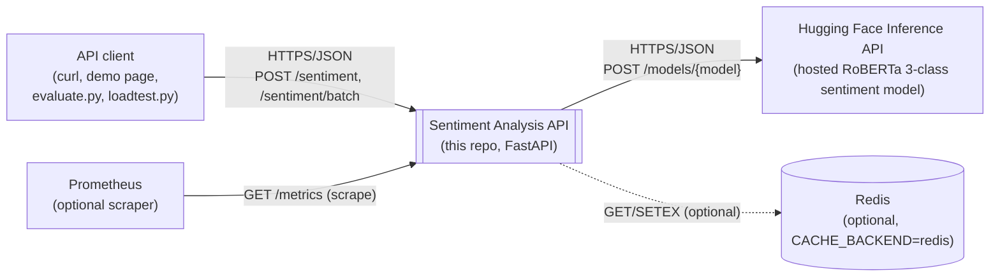
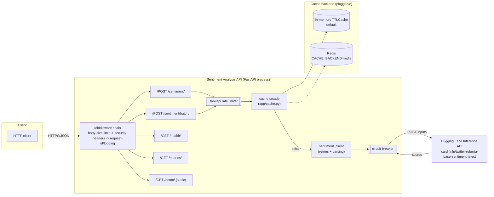
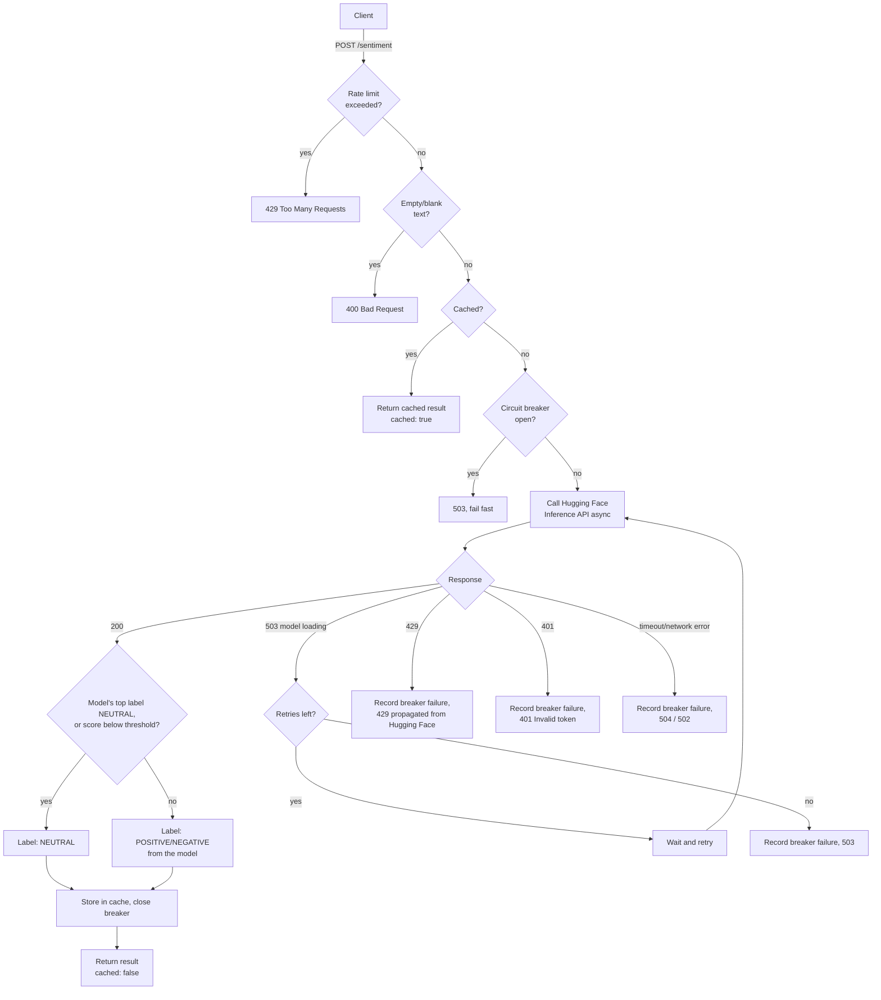
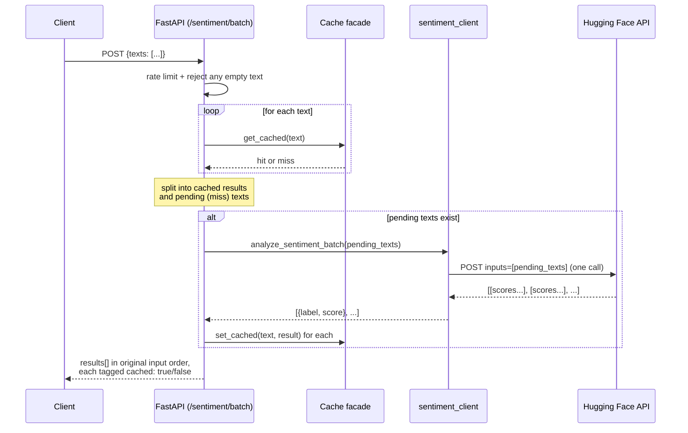
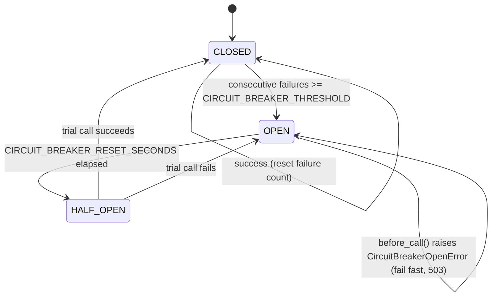
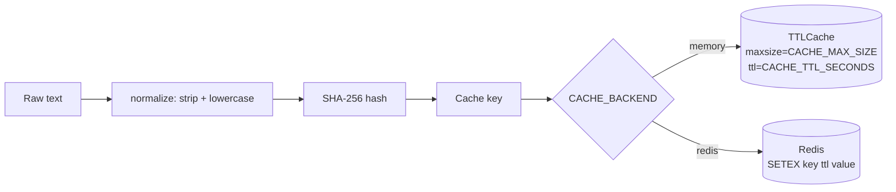
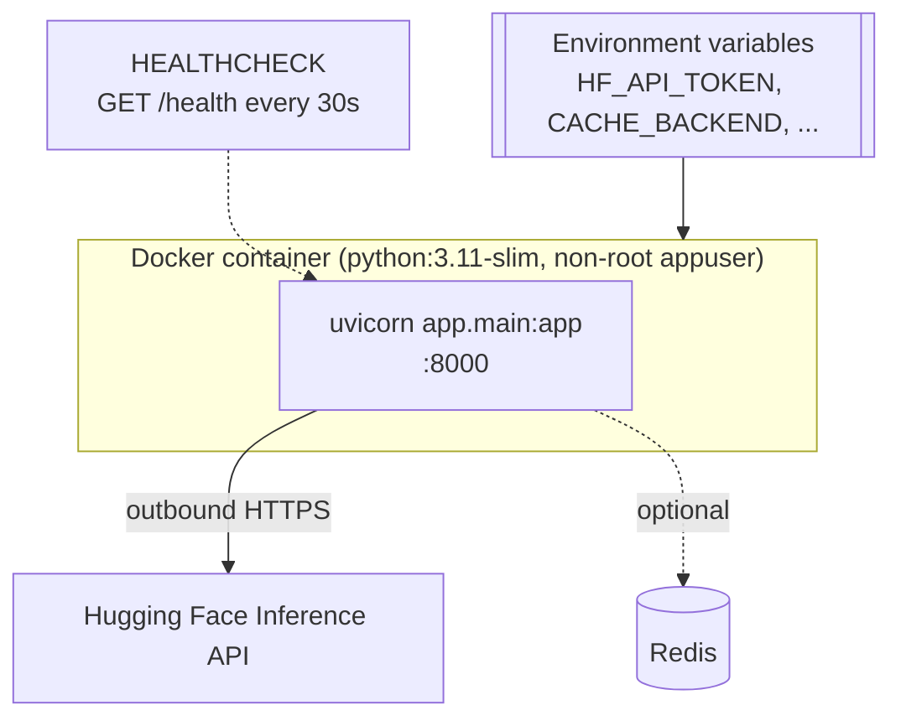

# Architecture

This document describes the system architecture of the Sentiment Analysis API: the
components, how they interact, and the key runtime flows. For *why* a given decision
was made (as opposed to *what* was built), see the [ADRs](adr/README.md) — this
document intentionally stays implementation-focused and links out to the relevant ADR
wherever a decision needs justification.

## Contents

- [System context](#system-context)
- [Components](#components)
- [Component diagram](#component-diagram)
- [Request flow: `POST /sentiment`](#request-flow-post-sentiment)
- [Request flow: `POST /sentiment/batch`](#request-flow-post-sentimentbatch)
- [Circuit breaker state machine](#circuit-breaker-state-machine)
- [Caching](#caching)
- [Configuration](#configuration)
- [Observability](#observability)
- [Deployment](#deployment)

## System context

The service is a single stateless FastAPI process that sits between API clients and the
Hugging Face Inference API. It adds caching, rate limiting, resilience (retries + circuit
breaker), and observability around a single upstream dependency: the hosted sentiment
model.

- **Client** — any HTTP caller: `curl`, the Swagger UI at `/docs`, the demo page at
  `/demo`, `scripts/evaluate.py`, or `scripts/loadtest.py`.
- **Sentiment Analysis API** — this repository; a single FastAPI app, one process, no
  internal service boundaries.
- **Hugging Face Inference API** — the only external dependency for inference. See the
  [request flow](#request-flow-post-sentiment) for how failures from it are handled.
- **Redis** — optional, only contacted when `CACHE_BACKEND=redis`; otherwise the cache
  lives in process memory and Redis is never touched (see [Caching](#caching)).
- **Prometheus** — optional; nothing breaks if nobody scrapes `/metrics`.

## Components

| Module | Responsibility |
|---|---|
| [`app/main.py`](../app/main.py) | FastAPI app, routes, middleware (request ID/logging, security headers, body-size limit), request/response models, rate limiting wiring |
| [`app/sentiment_client.py`](../app/sentiment_client.py) | Async HTTP client for Hugging Face: request building, retry-on-cold-model logic, response parsing, NEUTRAL bucketing, circuit-breaker integration |
| [`app/circuit_breaker.py`](../app/circuit_breaker.py) | Dependency-free CLOSED/OPEN/HALF_OPEN state machine guarding the upstream call |
| [`app/cache.py`](../app/cache.py) | Cache facade: normalizes/hashes text into a key, tracks hit/miss metrics, delegates to a backend |
| [`app/cache_backends.py`](../app/cache_backends.py) | `InMemoryCacheBackend` (default, `TTLCache`) and `RedisCacheBackend` (opt-in), both behind the same async `get`/`set` interface |
| [`app/config.py`](../app/config.py) | `Settings` — all configuration read once from environment variables at import time |
| [`app/logging_config.py`](../app/logging_config.py) | Structured (JSON) logging setup used by the request-logging middleware |
| [`static/index.html`](../static/index.html) | Zero-dependency demo page mounted at `/demo` |
| [`scripts/evaluate.py`](../scripts/evaluate.py) | Calls the running API against a labeled CSV; reports a confusion matrix and per-class precision/recall/F1 |
| [`scripts/calibrate_threshold.py`](../scripts/calibrate_threshold.py) | Sweeps `NEUTRAL_CONFIDENCE_THRESHOLD` against labeled data using real model scores fetched once per row |
| [`scripts/metrics_report.py`](../scripts/metrics_report.py) | Shared confusion-matrix / precision / recall / F1 helper used by both scripts above |
| [`scripts/loadtest.py`](../scripts/loadtest.py) | Concurrent load generator reporting throughput and latency percentiles |

There is no database and no persistent state beyond the cache (which is either
in-memory and disposable, or Redis, itself just a cache). The service can be scaled
horizontally by running more replicas; use `CACHE_BACKEND=redis` if replicas should
share cache entries instead of each keeping their own.

## Component diagram

## Request flow: `POST /sentiment`

Every step above is also logged and timed by the request-logging middleware (one JSON
line per request, with a `request_id` shared with the `X-Request-ID` response header),
and the cache hit/miss and circuit-breaker-trip counters feed `/metrics`
(see [Observability](#observability)).

## Request flow: `POST /sentiment/batch`

The batch endpoint follows the same cache-then-call shape as `/sentiment`, but resolves
the cache for *every* text first and sends only the misses to Hugging Face in a single
upstream call, preserving input order in the response (see
[ADR-0008](adr/0008-async-http-client-and-batch-endpoint.md)).

## Circuit breaker state machine

The breaker guards the Hugging Face call so that during a real upstream outage the
service fails fast (503) instead of retrying a dependency that is already down. See
[ADR-0010](adr/0010-circuit-breaker-for-upstream-resilience.md) for the rationale.

Both `analyze_sentiment` and `analyze_sentiment_batch` share **one** breaker instance
per process — a batch call failure counts the same as a single-text call failure.

## Caching

`app/cache.py` is the only module callers touch; it normalizes the text, hashes it,
tracks Prometheus hit/miss counters, and delegates to whichever backend
`CACHE_BACKEND` selects. Both backends implement the same two-method async interface
(`get`/`set`), so adding a third backend (e.g. Memcached) means adding one class, not
touching call sites (see [ADR-0012](adr/0012-pluggable-cache-backend.md)).

## Configuration

All configuration is environment-variable based, read once into `app.config.settings`
at import time via `python-dotenv` (`.env` in development, real environment variables in
production/containers). There is no config file format, no reload-on-change, and no
per-request configuration — restart the process to pick up changes. See
[`.env.example`](../.env.example) and the configuration reference table in the
[README](../README.md#configuration-reference) for the full variable list.

## Observability

- **Metrics** (`GET /metrics`, Prometheus format, via `prometheus-fastapi-instrumentator`):
  request count/latency/in-progress by route, plus custom counters —
  `sentiment_cache_hits_total`, `sentiment_cache_misses_total`,
  `sentiment_circuit_breaker_trips_total`. See
  [ADR-0011](adr/0011-observability-metrics-and-structured-logging.md).
- **Structured logs**: one JSON line per request (`request_id`, method, path, status
  code, duration) emitted by the logging middleware in `app/main.py`, configured in
  `app/logging_config.py`. The same `request_id` is returned as the `X-Request-ID`
  response header, so a client-reported issue can be traced straight to its log line.

## Deployment

The service ships as a single container (see [`Dockerfile`](../Dockerfile)): a slim
Python 3.11 base image, dependencies installed from `requirements.txt`, running as a
non-root user, exposing port 8000 with a built-in `HEALTHCHECK` against `/health`. It is
stateless — the only thing worth persisting across restarts is the cache, and only if
`CACHE_BACKEND=redis` is used to move it outside the container. Horizontal scaling is
just running more replicas behind a load balancer; nothing in the app assumes a single
instance except the in-memory cache backend (which then becomes per-replica, as noted in
[Caching](#caching)).
